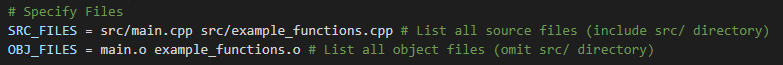

# Raylib-windows-template-2

This repository serves as a simple template for the raylib graphics library.
The primary goal of this template is to be self contained, meaning that the
number of dependencies for compilation has been minizmized.

The example program is written in c++ & includes a multiple source files and a simple makefile that
compiles & links statically to the raylib library.
To use a template that utilizes a single source file, please navigate to the 
[1st Raylib-windows-template](https://github.com/DevHawksUTM/Raylib-windows-template-1)

## Raylib Library

This repository contains the required header & object files needed
to compile your program with raylib. Raylib provides an easy way to 
incorporate graphics, sound, and user input into your programs.

*Files included from raylib v5.0 release*
Source Repository: https://github.com/raysan5/raylib

## Install OpenGL

Raylib requires the opengl library to link properly

Windows includes the opengl library by default

## Compiling

To compile the program: `make`

Then, to run the program: `./PROGRAM_NAME` *default is "program"*

If you wish to compile & then immediately run your program: `make run`

To clean up the workspace (objects & binary): `make clean`

## Configuring the Makefile

If change the names of the template source files, or add
your own files, you'll need to update the Makefile.

To do so, edit the `SRC_FILES` & `OBJ_FILES` fields in the Makefile

For your source files, make sure to add the "src/" path. Add these to `SRC_FILES`

Then, add the names of the files again. Without the "src/" path & with the ".o" extension.
Add these to `OBJ_FILES`
